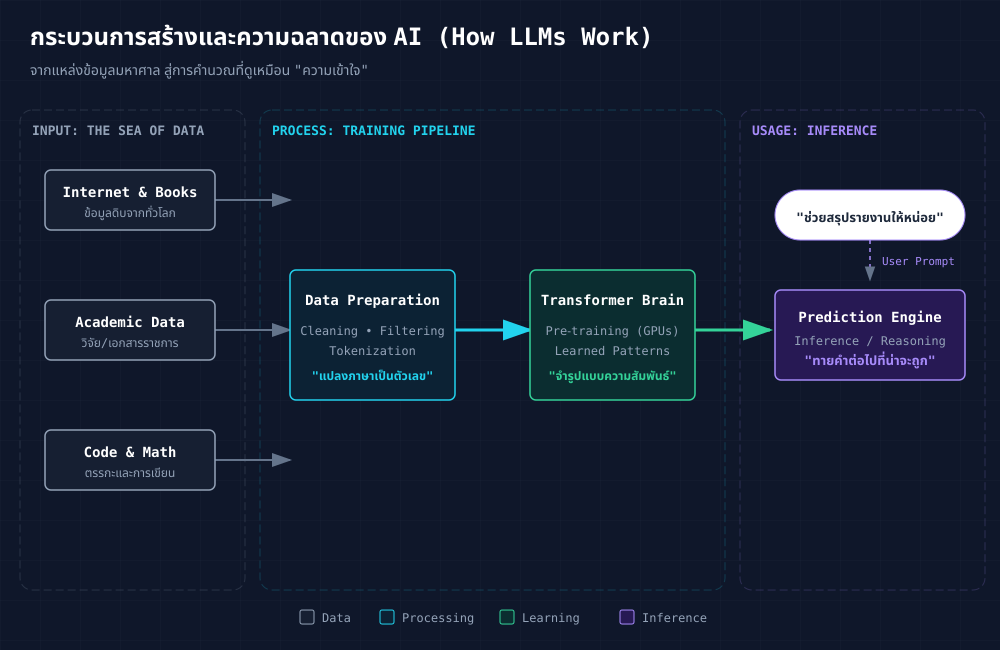

# Generative & Agentic AI

## การบูรณาการเทคโนโลยีปัญญาประดิษฐ์ในงานบริหารจัดการและสนับสนุนวิชาการ

  โดย ผศ.ดร.รุสลี่ สุทธวีร์กูล · ผู้ช่วยคณบดีฝ่ายสารสนเทศ 
  คณะวิศวกรรมศาสตร์ มจพ.

  📅 ๒๒ เมษายน ๒๕๖๙

  

  
  
Scan Slides

  
ruslylove.github.io/AI-workshop/1

---
layout: center
class: "!px-16"
---

# 🗺️ กำหนดการโครงการอบรมเชิงปฏิบัติการ

  

    

      PART 1
      09:00 – 10:30
    

    <h3 class="text-lg font-bold text-blue-900 mb-3">การบรรยายและการสาธิตเชิงปฏิบัติการ</h3>
    <ul class="text-sm text-gray-700 space-y-1.5">
      <li>🌱 วิวัฒนาการของเทคโนโลยีปัญญาประดิษฐ์: Chat → Gen → Agentic</li>
      <li>✨ การเปรียบเทียบคุณลักษณะของ ๓ แพลตฟอร์มหลัก (ChatGPT / Claude / Gemini)</li>
      <li>🤖 Agentic AI — นวัตกรรมระบบอัตโนมัติอัจฉริยะ</li>
      <li>🎯 เทคนิคการเขียนคำสั่ง (Prompt Engineering) สำหรับการปฏิบัติงาน</li>
      <li>🔮 การสาธิตกรณีศึกษา ๕ รูปแบบสำหรับการประยุกต์ใช้ในงานภาควิชา</li>
    </ul>
  

  

    

      PART 2
      10:45 – 12:00
    

    <h3 class="text-lg font-bold text-amber-900 mb-3">การประชุมเชิงปฏิบัติการ (Workshop)</h3>
    <ul class="text-sm text-gray-700 space-y-1.5">
      <li>🛠️ การแนะนำและเข้าใช้งานระบบ "Engineering AI Prompter"</li>
      <li>💻 การฝึกสร้างชุดคำสั่งเพื่อรองรับภารกิจในความรับผิดชอบ</li>
      <li>🙋 ช่วงการซักถามและให้คำปรึกษาแก้ไขปัญหาเชิงเทคนิค</li>
      <li>🌟 การแลกเปลี่ยนแนวคิดเพื่อการบูรณาการใช้งานในอนาคต</li>
    </ul>
  

  "มุ่งเน้นการประยุกต์ใช้งานจริงอย่างมีประสิทธิภาพ เพื่อยกระดับการปฏิบัติงาน"

---
layout: center
---

# 📣 รายงานสรุปข้อมูลผลการสำรวจความพึงพอใจและประเด็นปัญหา
## (การประเมินความต้องการเทคโนโลยีสารสนเทศเพื่อสนับสนุนการบริหารจัดการภายใน)

จากการรวบรวมข้อมูล พบว่าความท้าทายในการปฏิบัติงานมีความคล้ายคลึงกันในหลายหน่วยงาน...

  

    

    <h3 class="text-base font-bold text-blue-800 mb-3">🏆 ประเด็นปัญหาหลักที่ต้องการการสนับสนุนด้วยเทคโนโลยี</h3>
    <ul class="space-y-2 text-sm text-gray-700">
      <li class="flex gap-2">#1 ร่าง/แก้หนังสือราชการ &amp; แปลภาษา</li>
      <li class="flex gap-2">#2 จัดการสูตร Excel &amp; จัดระเบียบข้อมูล</li>
      <li class="flex gap-2">#3 งานประกาศ/โปรโมตข่าวสารต่างๆ</li>
      <li class="flex gap-2">#4 สรุปเอกสาร/ระเบียบข้อบังคับด่วน</li>
    </ul>
  

  

    

    <h3 class="text-base font-bold text-emerald-800 mb-3">🥰 ความคาดหวังจากการเข้าร่วมสัมมนา</h3>
    

      "ไม่เครียด" · "ใช้งานได้จริงทันที"  
      "ช่วยลดงานซ้ำซ้อน" · "ไม่วิชาการจ๋า"
    

    

      ✅ สำหรับหัวข้อสัมมนาวันนี้ จะเน้นการแก้ไขปัญหาเชิงปฏิบัติการของหน่วยงานโดยเฉพาะ
    

  

---
layout: section
---

# Chapter 1
## วิวัฒนาการของ AI
### วิวัฒนาการจากระบบประมวลผลพื้นฐาน สู่เทคโนโลยีผู้ช่วยอัจฉริยะ

ทำความเข้าใจวิวัฒนาการเพื่อเตรียมความพร้อมสู่ทิศทางในอนาคต

---

# 🕰️ ๓ ยุคสำคัญของเทคโนโลยีปัญญาประดิษฐ์ที่ควรทราบ

  

  

    

      
💬

      
~2015–2022

      <h3 class="font-bold text-gray-700 mt-1">AI Chatbot</h3>
      

        <b>รูปแบบ:</b> กล่อง Q&amp;A 
        <b>ความสามารถ:</b> ตอบตามสคริปต์/Rule 
        <b>คุณลักษณะ:</b> ระบบตอบโต้อัตโนมัติเบื้องต้น 
      

    

    

      
✨

      
2022–2024

      <h3 class="font-bold text-indigo-700 mt-1">Generative AI</h3>
      

        <b>รูปแบบ:</b> การสื่อสารและการสร้างสรรค์เนื้อหา 
        <b>ความสามารถ:</b> การนิพัทธ์เอกสาร/การแปล/การออกแบบภาพ/การสรุปความ 
        <b>คุณลักษณะ:</b> ผู้ช่วยดิจิทัลในการสร้างสรรค์เนื้อหาบริบทใหม่ 
      

    

    

      
🤖

      
2024–ปัจจุบัน

      <h3 class="font-bold text-pink-700 mt-1">Agentic AI</h3>
      

        <b>รูปแบบ:</b> การประมวลผลต่อเนื่องจากการสั่งการเพียงครั้งเดียว 
        <b>ความสามารถ:</b> การวางแผนเชิงปฏิบัติการและการเลือกใช้เครื่องมือ 
        <b>คุณลักษณะ:</b> ระบบอัตโนมัติที่มีขีดความสามารถในการตัดสินใจเชิงรุก (Proactive) 
      

    

  

  ในปัจจุบัน เทคโนโลยีส่วนใหญ่อยู่ในระดับที่ ๒ ซึ่งภารกิจในวันนี้คือการเตรียมความพร้อมเพื่อก้าวสู่ระดับที่ ๓

---

# 💡 การเปรียบเทียบความแตกต่างและคุณลักษณะเด่น

หัวข้อ: "การสรุปรายงานการประชุมครั้งล่าสุด พร้อมดำเนินการจัดส่งจดหมายอิเล็กทรอนิกส์แจ้งบุคลากรในภาควิชาฯ"

  

    

      
💬

      
CHATBOT

    

    

      ตอบเป็น FAQ ได้ ถ้าคำถามไม่ตรงสคริปต์ = "ขออภัย ฉันไม่เข้าใจคำถาม"
    

  

  

    

      
✨

      
GEN AI

    

    

      <b>ผู้ใช้งาน</b> ทำการคัดลอกเนื้อหาการประชุม → ระบบ AI สรุปสาระสำคัญ → <b>ผู้ใช้งาน</b> นำข้อมูลไปวางในจดหมายอิเล็กทรอนิกส์ → <b>ผู้ใช้งาน</b> ตรวจสอบรายชื่อ → <b>ผู้ใช้งาน</b> ดำเนินการจัดส่งด้วยตนเอง
      
→ "ศักยภาพผู้ช่วยที่มีประสิทธิภาพ แต่ยังต้องการการกำกับดูแลในทุกขั้นตอน"

    

  

  

    

      
🤖

      
AGENTIC

    

    

      <b>การสั่งการเพียงครั้งเดียว</b> → ระบบ AI เข้าถึงไฟล์การประชุมในระบบจัดเก็บข้อมูล → ดำเนินการสรุปความ → ตรวจสอบรายชื่อบุคลากรจากระบบฐานข้อมูล → จัดเตรียมร่างจดหมาย → <b>รอการตรวจสอบความถูกต้องก่อนดำเนินการจัดส่ง</b>
      
→ "นวัตกรรมผู้ช่วยเชิงรุกที่สามารถดำเนินภารกิจจนเสร็จสิ้นสมบูรณ์" ⚡

    

  

---
layout: section
---

# Chapter 2
## Generative AI
### เทคโนโลยีเพื่อการเพิ่มผลผลิตและนวัตกรรมงานเอกสาร

แนวทางการประยุกต์ใช้ "ผู้ช่วยดิจิทัลอัจฉริยะ" เพื่อเพิ่มประสิทธิภาพงาน

---

# 🧠 นิยามและคุณสมบัติพื้นฐานของ Generative AI

การพิจารณา AI ในฐานะส่วนหนึ่งของทีมปฏิบัติงาน...

  

    

      
📚

      <h3 class="font-bold text-gray-800">การประมวลผลข้อมูล</h3>
      
อ่านระเบียบพัสดุ 100 หน้า สรุปประเด็นสำคัญใน 30 วินาที

    

  

  

    

      
✍️

      <h3 class="font-bold text-gray-800">การสร้างสรรค์เนื้อหา</h3>
      
ร่างบันทึกข้อความ · แปลอีเมลภาษาอังกฤษระดับมืออาชีพ

    

  

  

    

      
💡

      <h3 class="font-bold text-gray-800">การวิเคราะห์เชิงตรรกะ</h3>
      
ช่วยวิเคราะห์ข้อมูล · เสนอไอเดีย · ตรวจความถูกต้อง

    

  

  💎 <b>ประเด็นสำคัญ:</b> Generative AI มิใช่เพียงเครื่องมือสืบค้นข้อมูล (Search Engine) แต่คือ <b>"ระบบสนับสนุนการสร้างสรรค์และวิเคราะห์งาน"</b>

---

# 🤖 กระบวนการประมวลผลและสร้างองค์ความรู้ของระบบ AI
### กลไกการทำงานเบื้องหลังของนวัตกรรมผู้ช่วยดิจิทัล

  

    
📚

    <h3 class="font-bold text-blue-800">1. การเรียนรู้จากฐานข้อมูลขนาดใหญ่</h3>
    
เรียนรู้จากข้อมูลมหาศาลบนอินเทอร์เน็ต ทั้งหนังสือ บทความ และงานวิจัย (Big Data)

  

  

    
🧠

    <h3 class="font-bold text-purple-800">2. การจดจำโครงสร้างสัมพันธ์</h3>
    
ไม่ได้ "ท่องจำ" แต่คือการ "เข้าใจความสัมพันธ์" ของคำและบริบท (Pattern Recognition)

  

  

    
🔮

    <h3 class="font-bold text-amber-800">3. การคาดการณ์หน่วยข้อมูลถัดไป</h3>
    
เมื่อเราสั่งงาน AI จะ "คำนวณ" ว่าคำตอบที่น่าจะเป็นไปได้มากที่สุดคืออะไร (Next Token Prediction)

  

  
    💡 <b>บทสรุปทางเทคนิค:</b> มีกลไกคล้ายคลึงกับระบบ <b>"การคาดการณ์คำล่วงหน้า"</b> (Predictive Text)  
    แต่มีประสิทธิภาพสูงกว่าและครอบคลุมชุดข้อมูลในระดับสากล
  

---

# 🏗️ เจาะลึก: สถาปัตยกรรมความฉลาด (Deep Dive)
### จากแหล่งข้อมูลต้นทาง สู่การประมวลผลระดับโครงข่ายประสาท

  

  

    <b>💡 เคล็ดลับน่ารู้:</b> AI ไม่ได้อ่านข้อมูลเป็น "คำ" แต่เปลี่ยนเป็น "พิกัดตัวเลข" (Vector) เพื่อหาความเชื่อมโยงในพื้นที่หลายมิติ
  

  

    <b>⚠️ ข้อควรระวัง:</b> เพราะมันคือการ "เดา" ตามสถิติ บางครั้งจึงอาจเกิด <b>Hallucination (การมั่ว)</b> หากข้อมูลต้นทางไม่มีหรือสับสน
  

---
layout: center
class: "text-center"
---

# นวัตกรรมผู้ช่วยดิจิทัลในระดับองค์กร
## เพื่อ การปฏิบัติงานที่มีเสถียรภาพและมีความต่อเนื่อง

  รองรับการทำงาน ๒๔ ชั่วโมง · ขีดความสามารถด้านภาษาไทยระดับสูง · อัตราค่าธรรมเนียมประมาณ ๗๐๐ บาท/เดือน

  

0

วันลา

  

24/7

ออนไลน์

  

100+

ภาษา

  

฿23/วัน

ค่าตัว

  ประเด็นพิจารณา: แนวทางการประยุกต์ใช้งานเพื่อความคุ้มค่าสูงสุด

---

# 🥊 การวิเคราะห์เปรียบเทียบแพลตฟอร์มหลัก (Leading AI Platforms 2026)

การเลือกสรรเครื่องมือที่เหมาะสมกับลักษณะงานเพื่อประสิทธิภาพสูงสุด

  

    

    

      

        
G

        

          
ChatGPT

          
OpenAI · GPT-5

        

      

      

        
✅ รองรับการใช้งานทั่วไปและมีความรอบรู้ในศาสตร์ที่หลากหลาย

        
✅ ขีดความสามารถด้านภาษาไทยอย่างเป็นกำเนิดและสละสลวย

        
✅ ระบบการสื่อสารด้วยเสียงที่มีความเป็นธรรมชาติระดับสูง (Advanced Voice Mode)

        
✅ การสร้างสรรค์ภาพและสารสนเทศเชิงภาพ (Infographics) จากชุดคำสั่ง

        
✅ GPTs: การพัฒนานวัตกรรมผู้ช่วยเฉพาะทางสำหรับส่วนงาน

      

      

        <b class="text-emerald-700">Go ~฿235/เดือน · Plus ~฿700/เดือน ($20)</b> 
        ความเหมาะสม: การใช้งานทั่วไป, การสื่อสารภาษาไทย และการสร้างสรรค์สื่อดิจิทัล
      

    

  

  

    
⭐ Best Office

    

    

      

        
C

        

          
Claude

          
Anthropic · Opus 4.7

        

      

      

        
✅ Word: การยกร่างหนังสือราชการและบันทึกข้อความเชิงวิชาการ

        
✅ Excel: การบริหารจัดการข้อมูลเชิงพัสดุและงบประมาณ พร้อมการวิเคราะห์สูตรสารสนเทศ

        
✅ PowerPoint: การเตรียมโครงสร้างสื่อการนำเสนอผลงาน

        
✅ Co-work: ระบบ Projects และ Artifacts เพื่อการปฏิบัติงานร่วมกันเชิงบูรณาการ

        
✅ Claude Code: การบริหารจัดการรหัสคำสั่งสำหรับภารกิจประมวลผลที่มีความซ้ำซ้อน

      

      

        <b class="text-orange-700">Pro ~$20/เดือน (~700 บาท)</b> 
        ความเหมาะสม: การร่างเอกสารราชการ, งานบริหารงบประมาณ และการวิเคราะห์ข้อมูลเชิงลึก
      

    

  

  

    

    

      

        
✦

        

          
Gemini

          
Google · Gemini 3 Pro

        

      

      

        
✅ ขีดความสามารถในการสืบค้นข้อมูลสารสนเทศที่ทันสมัย (Real-time Search)

        
✅ การบูรณาการร่วมกับระบบ Google Docs / Sheets / Slides และ Gmail อย่างไร้รอยต่อ

        
✅ NotebookLM: ระบบสรุปสาระสำคัญและแปรรูปข้อมูลสู่รูปแบบเสียงวิเคราะห์ (Podcast)

        
✅ Gemini Live: การตอบโต้ด้วยเสียงและภาพเพื่อการปรึกษาเชิงลึก

        
✅ สิทธิประโยชน์การใช้งานระดับสูงสำหรับสถาบันการศึกษา

      

      

        <b class="text-blue-700">ฟรี / Advanced ~$20/เดือน (~700 บาท)</b> 
        ความเหมาะสม: การบริหารจัดการข้อมูลผ่าน Google Workspace และการใช้งานระดับสากล
      

    

  

  💡 <b>แนวทางการพิจารณา:</b> งานทั่วไปและการสื่อสาร → <b class="text-emerald-600">ChatGPT</b> · งานเอกสารราชการและบัญชี → <b class="text-orange-600">Claude</b> · งานบริหารจัดการผ่านระบบคลาวด์ → <b class="text-blue-600">Gemini</b>

---

# 🧩 ศัพท์เทคนิค ๖ ประการที่ควรทราบเบื้องต้น

ความเข้าใจพื้นฐานในกลไกของ AI เพื่อการประยุกต์ใช้งานอย่างมีประสิทธิภาพ

  

    

      
🪙

      
Token

    

    

      หน่วยพื้นฐานที่ระบบ AI ใช้ในการประมวลข้อมูล "การอ่านและการเขียน" 
      ภาษาอังกฤษโดยเฉลี่ย ๐.๗๕ คำ/token · ภาษาไทยโดยเฉลี่ย ๑ อักษร/token
    

    

      💡 ยิ่ง token มาก → ยิ่งกินค่าใช้จ่าย/เวลา
    

  

  

    

      
🧠

      
Context Window

    

    

      "ความจำสั้น" ของ AI ในแต่ละบทสนทนา 
      รวม prompt + เอกสารแนบ + คำตอบ
    

    

      💡 คุยนานเกิน → AI ลืมต้น · ขึ้นบทใหม่
    

  

  

    

      
📝

      
Prompt

    

    

      คำสั่ง/คำถามที่เราป้อนให้ AI 
      ยิ่งชัด + มี context → ยิ่งได้ของดี
    

    

      💡 ดูสูตร R-T-C-F ใน Chapter 4
    

  

  

    

      
🌡️

      
Temperature

    

    

      ระดับ "ความสร้างสรรค์" ของคำตอบ 
      ต่ำ = ตรงเป๊ะ · สูง = ครีเอทีฟ/หลากหลาย
    

    

      💡 งานราชการ → ต่ำ · คำโฆษณา → สูง
    

  

  

    

      
⚠️

      
Hallucination

    

    

      AI "มั่ว" · แต่งข้อมูลที่ดูน่าเชื่อ 
      มักเกิดกับชื่อคน/เลขระเบียบ/อ้างอิง
    

    

      💡 ต้องตรวจทานก่อนใช้งานจริงเสมอ
    

  

  

    

      
🤖

      
Model

    

    

      รุ่น/เวอร์ชันของ AI ที่เลือกใช้ 
      GPT-5 · Claude 4.7 · Gemini 3
    

    

      💡 รุ่นใหม่ = ฉลาดกว่า แต่ช้า/แพงกว่า
    

  

  📌 <b>สรุปง่ายๆ:</b> <b class="text-blue-600">Token</b> = หน่วยนับ · <b class="text-purple-600">Context</b> = ความจำ · <b class="text-rose-600">Temperature</b> = ความครีเอทีฟ · ที่เหลือรู้ไว้ไม่หลงทาง

---

# 🎛️ ปรับ 2 ปุ่มสำคัญ — Temperature & Context

เลือกให้ถูกกับงาน · ผลลัพธ์เปลี่ยนทันที

  

    

    

      

        
🌡️

        

          
Temperature

          
ความสร้างสรรค์ของคำตอบ · 0.0 – 2.0

        

      

      

        

          

            
🧊 ต่ำ (0.0 – 0.3)

            
เป๊ะ · นิ่ง

          

          
หนังสือราชการ · แปลเอกสาร · สูตร Excel · สรุปข้อเท็จจริง

        

        

          

            
🌤️ กลาง (0.4 – 0.8)

            
สมดุล · ทั่วไป

          

          
อีเมล · บันทึกข้อความ · สรุปประชุม · ตอบคำถามทั่วไป

        

        

          

            
🔥 สูง (0.9 – 1.5)

            
ครีเอทีฟ

          

          
คำโปรย/สโลแกน · ไอเดียกิจกรรม · บทพูด · โพสต์โซเชียล

        

      

      

        💡 ChatGPT/Claude บน Web ตั้งค่า "กลาง" ให้อัตโนมัติ · ถ้าอยากเปลี่ยน ให้ <b>บอกในคำสั่ง</b> เช่น "ตอบให้เป๊ะที่สุด" หรือ "เสนอไอเดียหลากหลาย"
      

    

  

  

    

    

      

        
🧠

        

          
Context Window

          
"ความจำ" ในแต่ละบทสนทนา · นับเป็น token

        

      

      

        

          
📏 รุ่นใหม่ปี 2026 · ใหญ่มาก

          

            
• Claude 4.7 · GPT-5 · Gemini 3 → 200K – 1M tokens

            
• เทียบเท่า <b>หนังสือ 500–2,000 หน้า</b> ในครั้งเดียว

          

        

        

          
⚠️ สัญญาณว่าเต็ม/ใกล้เต็ม

          

            
• AI ตอบช้า · ลืมข้อมูลที่บอกไว้ต้นบท

            
• ยกตัวอย่างผิดจากไฟล์ที่แนบมา

            
• เริ่มสับสนประเด็น · วนตอบซ้ำ

          

        

        

          
✅ เคล็ดลับประหยัด context

          

            
• 1 บทสนทนา = 1 งาน → ขึ้นบทใหม่เมื่อเปลี่ยนเรื่อง

            
• แนบเฉพาะหน้าที่เกี่ยวข้อง ไม่ต้องยกเล่มมาทั้งหมด

            
• สรุปบทสนทนายาว ก่อนถามต่อ

          

        

      

    

  

---

# 💬 ตัวช่วยตอบคำถามซ้ำๆ (AI FAQ Assistant) 🗣️
งานบริการการศึกษา / งานทะเบียน / ติดต่อสอบถาม

  

    

      <h3 class="font-bold text-red-700 text-sm">😫 ปัญหาเดิมๆ</h3>
      <ul class="list-disc pl-4 text-[10px] text-gray-600 space-y-1 mt-1">
        <li>"ลงทะเบียนเพิ่มถอนวันไหนคะ?"</li>
        <li>"ยื่นคำร้องออนไลน์ตรงไหนครับ?"</li>
        <li>"ขอใบรับรองเกรดรอนานไหม?"</li>
        <li>(ตอบวันละ 50 รอบ จนหมดไฟทำงาน...)</li>
      </ul>
    

    

      <h3 class="font-bold text-blue-700 text-sm">🤖 AI Solution</h3>
      
ใช้ AI สร้าง <b>"คลังคำตอบสำเร็จรูป"</b> ไว้ Copy-Paste หรือทำ Chatbot

      

        <b class="text-blue-800 text-[10px]">Step 1: โยนคู่มือลงไป</b> 
        "นี่คือไฟล์ PDF คู่มือนิสิตปี 69..."
      

      

        <b class="text-blue-800 text-[10px]">Step 2: สั่งให้สร้าง Script</b> 
        "ช่วยลิสต์คำถามที่พบบ่อย 10 ข้อ พร้อมคำตอบที่สั้น กระชับ และสุภาพ สำหรับตอบทาง LINE"
      

    

  

  

    
🤖💬

    

      

         

         

         

      

      

        <b>Q:</b> ลงทะเบียนเพิ่มถอนวันไหนคะ? 
        <b>AI:</b> สวัสดีค่ะสำหรับการลงทะเบียนเพิ่ม-ถอน ภาคการศึกษา 1/2569 
        🗓️ <b>เริ่มวันที่:</b> 10 - 24 ก.ค. 69 
        🔗 <b>ลิงก์:</b> reg.kmutnb.ac.th 
        (หากเลยกำหนดต้องยื่นคำฟ้อง พ.14 นะคะ)
      

    

  

---

# 📝 สรุปการประชุมอัตโนมัติ (Meeting Minute Savior) 🎙️
งานบริหาร / งานภาควิชา / งานเลขานุการ

  

     <h3 class="font-bold text-indigo-800 text-sm mb-2">The Workflow 🚀</h3>
     

       

         
1️⃣

         

           <b class="text-xs block">อัดเสียง (Record)</b>
           ใช้มือถือ / Teams recording
         

       

       

         
2️⃣

         

           <b class="text-xs block">ถอดความ (Transcribe)</b>
           ใช้ Alrite (ฟรี) / Word Dictate
         

       

       

         
3️⃣

         

           <b class="text-xs block">สรุปประเด็น (Summarize)</b>
           โยน Text ให้ AI สรุป
         

       

     

  

  
  

    <h3 class="font-bold text-gray-700 mb-1 text-sm">💡 Prompt สำหรับสรุปงาน</h3>
    <CopyBox text="ช่วยสรุปบทสนทนานี้เป็น 'รายงานการประชุม' โดยแยกหัวข้อดังนี้: 1.วาระเพื่อทราบ 2.วาระเพื่อพิจารณา (มติที่ประชุมคืออะไร?) 3.สิ่งที่ต้องดำเนินการต่อ (Action Items - ใคร ทำอะไร ภายในเมื่อไหร่)">
      

        "ช่วยสรุปบทสนทนานี้เป็น <b>'รายงานการประชุม'</b>  
        โดยแยกหัวข้อดังนี้: 
        1. วาระเพื่อทราบ 
        2. วาระเพื่อพิจารณา (มติที่ประชุมคืออะไร?) 
        3. สิ่งที่ต้องดำเนินการต่อ (<b>Action Items</b> - ใคร ทำอะไร ภายในเมื่อไหร่)"
      

    </CopyBox>
    

      *ลดเวลาทำรายงานการประชุมจาก 3 วัน -> 30 นาที
    

  

---

# 📋 ร่าง TOR & เทียบสเปก (Procurement Pro) 🏗️
งานพัสดุ / งานจัดซื้อ / คณะกรรมการตรวจรับ

  
  <!-- Task 1: Draft TOR -->
  

    

      📝
      <h3 class="font-bold text-teal-800 text-sm">1. ร่างสเปก (TOR)</h3>
    

    
"อยากได้คอมฯ แรงๆ ไว้ตัดต่อ 5 เครื่อง แต่เขียนสเปกราชการไม่เป็น"

    

      <b class="text-teal-700 text-[10px]">Prompt:</b>
      

        "ช่วยร่างคุณลักษณะเฉพาะ (Spec) คอมพิวเตอร์สำหรับงานตัดต่อวิดีโอ 4K งบประมาณเครื่องละ 40,000 บาท โดยระบุ CPU, RAM, SSD, GPU ให้ชัดเจน และต้องเป็นกลาง ไม่ล็อกสเปกยี่ห้อใด"
      

    

  

  <!-- Task 2: Compare Quotes -->
  

    

      ⚖️
      <h3 class="font-bold text-orange-800 text-sm">2. เปรียบเทียบราคา (Compare)</h3>
    

    
"มีใบเสนอราคา 3 เจ้า (PDF/รูปภาพ) ดูยากว่าใครคุ้มสุด"

    

      <b class="text-orange-700 text-[10px]">Action:</b>
      

        Upload ไฟล์ใบเสนอราคา A, B, C แล้วสั่ง: 
        "สร้างตารางเปรียบเทียบสเปกและราคาของทั้ง 3 เจ้าให้หน่อย ไฮไลท์จุดที่แตกต่างกัน และแนะนำว่าเจ้าไหนคุ้มค่าที่สุดในงบ 5 หมื่น"
      

    

  

   

     ⚠️ Tip: อย่าลืมตรวจสอบความถูกต้องกับระเบียบพัสดุล่าสุดเสมอ (AI เป็นแค่ผู้ช่วยร่าง)
   

---
layout: center
---

# 🎨 กิจกรรมการเรียนรู้เชิงประสบการณ์

การประเมินขีดความสามารถเบื้องต้นและกลไกการรับรู้ของระบบปัญญาประดิษฐ์

  <a href="https://quickdraw.withgoogle.com/" target="_blank" class="group">
    

      
🖍️

      
Quick, Draw!

      
AI ทายภาพวาดของเรา

    

  </a>
  <a href="https://teachablemachine.withgoogle.com/" target="_blank" class="group">
    

      
🎓

      
Teachable Machine

      
สอน AI ได้ใน 3 นาที

    

  </a>

---
layout: section
---

# 🎬 Live Demo
## การประยุกต์ใช้ Generative AI ในงานระดับปฏิบัติการ
### กรณีศึกษา 6 รูปแบบจากการดำเนินงานจริงของส่วนงาน

แนวทางการใช้งานเชิงปฏิบัติเพื่อผลลัพธ์ที่เป็นรูปธรรม

---

# 🔮 กรณีศึกษาที่ ๑: ภารกิจด้านงานสารบรรณและวิเทศสัมพันธ์

การจัดทำบันทึกข้อความและการสื่อสารภาษาอังกฤษเชิงธุรกิจ

  

    

      ขั้นตอนที่ 1: การจัดทำร่างบันทึกข้อความ
    

    <CopyBox text="กรุณาจัดทำร่างบันทึกข้อความเพื่อขออนุมัติจัดโครงการสัมมนา 'International AI Seminar 2026' เพื่อส่งเสริมศักยภาพด้านวิเทศสัมพันธ์ของภาควิชาฯ โดยกำหนดงบประมาณที่ 50,000 บาท เรียน หัวหน้าภาควิชาวิศวกรรมไฟฟ้าและคอมพิวเตอร์ โปรดใช้รูปแบบตามระเบียบงานสารบรรณ พ.ศ. 2565">
      

        "ร่างบันทึกข้อความ <b>ขออนุมัติจัดโครงการ 'International AI Seminar 2026'</b> เพื่อยกระดับความเป็นนานาชาติของภาควิชา งบ <b>50,000 บาท</b> เรียน <b>คณบดี</b> ขอรูปแบบตามระเบียบงานสารบรรณ 2565"
      

    </CopyBox>
  

  

    

      ขั้นตอนที่ 2: การพัฒนาจดหมายเชิญผู้ทรงคุณวุฒิ (ต่อเนื่อง)
    

    <CopyBox text="จากรายละเอียดโครงการข้างต้น กรุณาดำเนินการร่างจดหมายอิเล็กทรอนิกส์ (Email) เพื่อเรียนเชิญ Prof. Hiroshi Tanaka จาก University of Tokyo ให้เกียรติเป็นวิทยากรบรรยายพิเศษ (Keynote Speaker) ในหัวข้อ 'AI for Future Administration' โดยทางหน่วยงานจะดูแลค่าใช้จ่ายด้านการเดินทางและที่พัก โปรดใช้ภาษาอังกฤษเชิงธุรกิจ (Business English) ในระดับทางการและสุภาพ">
      

        "จากโครงการเมื่อกี้ ร่างอีเมลเชิญ <b>Prof. Hiroshi Tanaka (U. of Tokyo)</b> เป็น Keynote หัวข้อ <b>'AI for Future Administration'</b> ทางเราออกค่าตั๋ว+ที่พัก ขอ <b>Business English</b> โทนอบอุ่น"
      

    </CopyBox>
  

  💎 <b>ประสิทธิภาพหลัก:</b> ความสามารถด้าน Context Processing ทำให้ระบบจดจำรายละเอียดเดิมได้โดยไม่ต้องระบุซ้ำ

---

# 🔮 กรณีศึกษาที่ ๒: ภารกิจด้านบริหารงานกายภาพและงานประชาสัมพันธ์ส่วนงาน

การจัดทำประกาศและการพัฒนาสื่อมัลติมีเดีย (AI Avatar)

  

    

      ขั้นตอนที่ 1: การจัดทำร่างประกาศส่วนงาน
    

    <CopyBox text="กรุณาจัดทำร่างประกาศเพื่อแจ้งการปิดปรับปรุงห้องปฏิบัติการคอมพิวเตอร์ของภาควิชาฯ ระหว่างวันที่ 15-17 พฤษภาคม 2569 พร้อมระบุคำขออภัยในความไม่สะดวกและแจ้งห้องปฏิบัติการทดแทน สำหรับใช้สื่อสารบนทางกระดานประชาสัมพันธ์และสื่อสังคมออนไลน์">
      

        "ร่างประกาศ <b>ปิดปรับปรุงห้องแล็บคอมฯ</b> วันที่ 15-17 พ.ค. 2569 โทนขออภัย แนะนำห้องสำรอง พร้อมอีโมจิ 🙏 — <b>สำหรับติดบอร์ด + โพสต์เพจภาค</b>"
      

    </CopyBox>
    

      ขั้นตอนที่ 2: การพัฒนาบทบรรยาย (Script) สำหรับวิดีโอประชาสัมพันธ์
    

    <CopyBox text="กรุณาแปลงเนื้อหาจากประกาศข้างต้นเป็นบทพูด (Script) สำหรับวิดีโอความยาว 30 วินาที เพื่อใช้สำหรับ AI Avatar โดยใช้น้ำเสียงที่สุภาพและมีความเป็นมืออาชีพ">
      

        "แปลงประกาศนี้เป็นบทพูด <b>30 วินาที</b> · ภาษาพูดเป็นกันเอง สำหรับ <b>AI Avatar</b>"
      

    </CopyBox>
  

  

    

      
🎥 TOOLS

      

        
H <b>HeyGen</b> — Avatar พูดไทยได้ดี

        
D <b>D-ID</b> — Photo → Talking Head

        
S <b>Synthesia</b> — Avatar มืออาชีพ

      

    

    

      Prompt → Script → Avatar Video  
      <b>ใช้เวลา ~10 นาที</b>
    

  

---

# 🔮 กรณีศึกษาที่ ๓: การวิเคราะห์และสืบค้นข้อมูลเชิงลึกจากเอกสาร (Document AI)

การสกัดข้อมูลสำคัญจากเอกสารจำนวนมากด้วยประสิทธิภาพสูง

  

    

      
📋 โจทย์จริง

      <ul class="text-sm text-gray-700 space-y-2 list-disc pl-5">
        <li>PDF "ระเบียบการเบิกจ่าย" หนา 100 หน้า</li>
        <li>อยากรู้แค่ <b>"ค่าที่พักเบิกได้เท่าไหร่?"</b></li>
        <li>ถ้าเปิดอ่าน → ใช้เวลา 30 นาที</li>
      </ul>
    

    

      <b class="text-gray-500 text-xs tracking-wider">⚡ ACTION</b>
      <CopyBox text="กรุณาสรุปหลักเกณฑ์การเบิกจ่ายค่าเช่าที่พักสำหรับบุคลากรสายสนับสนุน จากเอกสารระเบียบฉบับนี้ โดยระบุอัตราการเบิกจ่าย หลักฐานที่จำเป็นต้องใช้ประกอบการตั้งเบิก และหมายเลขหน้าอ้างอิงในเอกสาร">
        

          "สรุป <b>'ค่าเช่าที่พัก'</b> สำหรับพนักงานสายสนับสนุน เบิกคืนละกี่บาท · ใช้หลักฐานอะไร · อ้างหน้าไหน"
        

      </CopyBox>
    

  

  

    

      
📑

      
100 หน้า → 1 ประโยค

      
30 นาที → 10 วินาที

      

        Best for this:  
        <b class="text-gray-600">Claude · Gemini · NotebookLM</b>
      

    

  

---

# 🔮 กรณีศึกษาที่ ๔: การสรุปสาระสำคัญเพื่อประกอบการนำเสนอ (Data Visualization)

การแปรรูปเนื้อหาจากเอกสารกำหนดการสู่สื่อประชาสัมพันธ์เชิงกราฟิก

  

    
📄

    
1. PDF

    
กำหนดการ

  

  

    
✂️

    
2. Extract

    
ดึง Text ด้วย AI

  

  

    
🎨

    
3. Design

    
Piktochart/Gamma

  

  

    
🎁

    
4. Share

    
โพสต์ได้เลย

  

<CopyBox text="กรุณาวิเคราะห์และรวบรวมประเด็นสำคัญจากเอกสารกำหนดการนี้ เพื่อจัดทำข้อมูลสรุปสำหรับผลิตสื่ออินโฟกราฟิก โดยเน้นการจัดหมวดหมู่เวลา กิจกรรม และรายละเอียดที่สำคัญในรูปแบบหัวข้อที่กระชับ">
  

    <b>Prompt:</b> "การประมวลผลสรุปสาระสำคัญจากไฟล์ PDF เพื่อจัดทำหัวข้อประกอบสื่ออินโฟกราฟิก โดยเน้นข้อมูลเชิงปริมาณและกำหนดเวลา"
  

</CopyBox>

  🛠️ <b>Tools แนะนำ:</b> Piktochart AI · Gamma · Canva Magic Design · Napkin.ai

---

# 🔮 กรณีศึกษาที่ ๕: การวิเคราะห์และเปรียบเทียบข้อมูลเชิงปริมาณ (Data Analytics)

การวิเคราะห์ความเปลี่ยนแปลงเชิงสถิติจากไฟล์ข้อมูล Excel หลายฉบับ

  

    

      
📋 โจทย์จริง

      <ul class="text-sm text-gray-700 space-y-2 list-disc pl-5">
        <li>Excel 4 ไฟล์ (ก.ย.–ธ.ค. 2568)</li>
        <li>หาว่า <b>"รายการไหนปรับราคาขึ้น?"</b> และ <b>"กี่ %?"</b></li>
        <li>เปิดเทียบทีละไฟล์ = ตาลาย</li>
      </ul>
    

    <CopyBox text="กรุณาดำเนินการวิเคราะห์เปรียบเทียบราคาวัสดุจากไฟล์ข้อมูลการจัดซื้อทั้ง 4 ฉบับ พร้อมจัดทำตารางสรุปรายการที่มีการปรับราคาเพิ่มขึ้น โดยระบุสัดส่วนการเปลี่ยนแปลงร้อยละ (Percentage) และเรียงลำดับจากสูงไปต่ำ">
      

        "การเปรียบเทียบข้อมูลจากไฟล์สารสนเทศ ๔ ฉบับ เพื่อจัดทำตารางสรุปรายการที่มีการปรับเพิ่มราคา พร้อมคำนวณร้อยละการเปลี่ยนแปลงและเรียงลำดับตามความสำคัญ"
      

    </CopyBox>
  

  

    
📈

    
4 ไฟล์ → 1 ตาราง

    
ภายใน 30 วินาที

    

      <b class="text-gray-600">ChatGPT · Claude</b> 
      (ทั้งคู่วิเคราะห์ Excel ได้ดี)
    

  

---

# 🔮 กรณีศึกษาที่ ๖: การพัฒนาระบบจัดเก็บและประมวลผลข้อมูลอัตโนมัติ (Automated Forms)

กระบวนการจัดทำแบบสำรวจผลการดำเนินงานโครงการ ECE Open House

  

    

      ขั้นตอนที่ 1: การออกแบบข้อคำถามและการตรวจสอบความถูกต้อง
    

    <CopyBox text="กรุณาออกแบบข้อคำถามสำหรับแบบประเมินความพึงพอใจโครงการ ECE Open House ของภาควิชาวิศวกรรมไฟฟ้าและคอมพิวเตอร์ โดยกำหนดหัวข้อให้ครอบคลุมกิจกรรมต่างๆ (เช่น ห้องปฏิบัติการคอพิวเตอร์, ระบบไฟฟ้ากำลัง, มอเตอร์) รวมจำนวน 5-7 ข้อ ในรูปแบบมาตรวัดประมาณค่าและคำถามปลายเปิด">
      

        "การยกร่างหมวดรายการข้อคำถามสำหรับแบบประเมินโครงการ ECE Open House ของภาควิชาวิศวกรรมไฟฟ้าและคอมพิวเตอร์ โดยครอบคลุมกิจกรรมห้องปฏิบัติการที่กำหนด พร้อมใช้รูปแบบมาตรวัดประมาณค่าและคำถามปลายเปิด"
      

    </CopyBox>
    
✓ ผู้ใช้ตรวจสอบคำถาม, ปรับแก้, และกดยืนยัน

  

  

    

      ขั้นตอนที่ 2: การพัฒนา Google Apps Script เพื่อสร้างระบบแบบฟอร์ม
    

    <CopyBox text="กรุณาดำเนินการเขียนรหัสคำสั่ง Google Apps Script ตามชุดข้อคำถามที่ผ่านการตรวจสอบแล้ว เพื่อใช้สำหรับการสร้างระบบ Google Form โดยอัตโนมัติ พร้อมคำอธิบายขั้นตอนการรันรหัสคำสั่งในระบบ">
      

        "ดำเนินการเขียนรหัสคำสั่ง Google Apps Script ตามชุดข้อคำถามที่กำหนด เพื่อใช้สำหรับการสร้างระบบ Google Form โดยอัตโนมัติ พร้อมอธิบายขั้นตอนการดำเนินงานในระบบ"
      

    </CopyBox>
    

      ⚙️
      

        <strong class="text-sm font-bold text-orange-700 block mb-0.5">การสร้างระบบแบบฟอร์มสำเร็จภายในระยะเวลาอันสั้น</strong>
        ก๊อปปี้โค้ดไปรัน ไม่ต้องนั่งพิมพ์เอง
      

    

  

  💡 <b>หลักการสำคัญ:</b> กระบวนการทำงานแบบ Human-in-the-loop — การตรวจสอบความถูกต้องของข้อมูลโดยผู้ใช้งานก่อนการดำเนินงานขั้นถัดไป

---
layout: center
class: "!px-20"
---

# 🎙️ NotebookLM

อัปโหลด PDF ระเบียบพัสดุ 100 หน้า → ได้ <b>Podcast 2 คนคุยภาษาไทย</b> 10 นาที

  

    
📄

    
Upload

    
PDF/Slides/URL

  

  

    
⚡

    
Generate

    
5 นาที

  

  

    
🎧

    
Podcast

    
ฟังในรถได้

  

→ Use case: ฟังระเบียบระหว่างขับรถมาทำงาน

---

# 🪄 สร้างสไลด์ด้วย AI (Gamma.app)

การจัดทำสื่อนำเสนอจำนวน ๑๐ หน้า พร้อมการออกแบบและภาพประกอบที่สมบูรณ์จากการระบุหัวข้อเพียงครั้งเดียว

  

    
💬

    
การระบุชุดคำสั่งเพียงประโยคเดียว

    
เช่น "แนะนำภาควิชาให้เด็ก ม.ปลาย ฟัง"

  

  

    
✨

    
ระบบ AI ดำเนินการจัดสรรโครงร่าง

    
เลือกธีม ภาพประกอบ เลย์เอาต์ให้เอง

  

  

    
📊

    
พร้อมพรีเซนต์ทันที

    
Export เป็น PDF หรือ PowerPoint (PPTX) ได้เลย

  

→ Use case: สไลด์รายงานผลด่วน · แนะนำหลักสูตร · นำเสนอโครงการวิจัย

---

# 🧰 คู่มือการเลือกใช้เครื่องมือ AI อ้างอิงตามลักษณะงาน

  

    
สื่อการนำเสนอ (Presentations)

    <ul class="space-y-1.5 text-gray-700">
      <li>⭐ <b>Gamma.app</b> — การออกแบบแบบอัตโนมัติจากข้อความเพียงประโยคเดียว</li>
      <li>• Beautiful.ai — การดำเนินงานด้วยดีไซน์เรียบหรูในระดับมืออาชีพ</li>
      <li>• Tome — ระบบ Storytelling สำหรับการเล่าเรื่องเชิงลึก</li>
    </ul>
  

  

    
สื่อดิจิทัลและกราฟิก (Images)

    <ul class="space-y-1.5 text-gray-700">
      <li>⭐ <b>DALL·E 3</b> — บูรณาการร่วมกับ ChatGPT เพื่อความสะดวกในการสื่อสาร</li>
      <li>• Midjourney — งานศิลป์และการผลิตภาพคุณภาพสูงระดับสูงสุด</li>
      <li>• Freepik / Leonardo — รูปภาพคุณภาพสูงที่เน้นความสะดวกในการใช้งาน</li>
    </ul>
  

  

    
สื่อมัลติมีเดียและเอนิเมชัน (Video & Avatar)

    <ul class="space-y-1.5 text-gray-700">
      <li>⭐ <b>HeyGen</b> — ระบบ Avatar ที่รองรับการสื่อสารภาษาไทยระดับสูง</li>
      <li>• Synthesia — ระบบ Avatar สำหรับการใช้งานในองค์กรขนาดใหญ่</li>
      <li>• ElevenLabs — เทคโนโลยีการสังเคราะห์เสียง (Voice Cloning)</li>
    </ul>
  

  

    
การวิเคราะห์เอกสารและงานวิจัย (Analysis & Research)

    <ul class="space-y-1.5 text-gray-700">
      <li>⭐ <b>NotebookLM</b> — การแปรรูปเอกสารและ PDF สู่รูปแบบเสียงวิเคราะห์ (Podcast)</li>
      <li>⭐ <b>Perplexity</b> — ระบบสืบค้นข้อมูลเชิงลึกพร้อมแหล่งอ้างอิงที่เชื่อถือได้</li>
      <li>• SciSpace — ระบบเจาะลึกและสืบค้นงานวิจัยระดับวิชาการ (Academic Paper)</li>
    </ul>
  

  

    
สารสนเทศเชิงภาพ (Infographics)

    <ul class="space-y-1.5 text-gray-700">
      <li>⭐ <b>Napkin.ai</b> — การแปลงข้อความสู่แผนภาพเชิงสัญญะโดยฉับพลัน</li>
      <li>• Piktochart AI — ระบบช่วยเหลือการออกแบบเลย์เอาต์ Infographic</li>
      <li>• Venngage — แหล่งรวบรวมแม่แบบสำหรับงานทางวิชาการและสถิติ</li>
    </ul>
  

  

    
งานบริหารธุรการและการสื่อสาร (Office & Messaging)

    <ul class="space-y-1.5 text-gray-700">
      <li>⭐ <b>Claude 3.5</b> — ผู้ช่วยวิเคราะห์ข้อมูลและการสรุปเอกสารราชการ</li>
      <li>⭐ <b>Gemini</b> — การพัฒนารหัสคำสั่งสำหรับ Google Workspace (Forms/Sheets)</li>
      <li>• MS Copilot — การทำงานร่วมกับชุดโปรแกรม Office 365 อย่างมีประสิทธิภาพ</li>
    </ul>
  

  ⭐ = เครื่องมือหลักที่ใช้ในการสาธิตกระบวนงานวันนี้

---
layout: section
---

# Chapter 3
## Agentic AI
### นวัตกรรมระบบอัตโนมัติอัจฉริยะ (Autonomous Agents)

ความก้าวหน้าจากการตอบโต้ สู่การปฏิบัติงานเชิงรุก

---

# 🤖 Agentic AI คืออะไร?

  

    

      
DEFINITION

      

        นวัตกรรมระบบที่สามารถ <b>บริหารจัดการแผนงาน</b> <b>ประยุกต์ใช้เครื่องมือดิจิทัล</b> (สืบค้นเว็บ, การจัดทำฐานข้อมูล, การสื่อสารอัตโนมัติ) และ <b>สามารถดำเนินงานเชิงรุก</b> เพื่อเป้าหมายตามที่กำหนด
      

    

    

      <b>นิยามเชิงเปรียบเทียบ:</b> Generative AI คือ <i>"ระบบตอบโต้ข้อมูล"</i> 
      Agentic AI คือ <i>"ระบบบริหารจัดการโครงการ"</i>
    

  

  

    

      
1

      

        
🎯 Planning — การวางแผนเชิงกลยุทธ์

        
ความสามารถในการแยกย่อยภารกิจตามลำดับความสำคัญ

      

    

    

      
2

      

        
🛠️ Tool Use — การบูรณาการเครื่องมือ

        
การเข้าถึงฐานข้อมูล, การประมวลผลตารางคำนวณ และระบบโต้ตอบ

      

    

    

      
3

      

        
🧠 Memory — ระบบการจดจำบริบท

        
การวิเคราะห์ประวัติการดำเนินงานและรักษาสภาพแวดล้อมปัจจุบัน

      

    

    

      
4

      

        
🔄 Self-correction — ระบบตรวจสอบและแก้ไข

        
การดำเนินการตรวจสอบความผิดพลาดและปรับปรุงผลลัพธ์อัตโนมัติ

      

    

  

---

# 🌟 Agentic AI ยุคใหม่ (2026)

  

    

      
🖥️

      

        
Claude Computer Use

        
Anthropic

      

    

    
เปิดเว็บไซต์ · คลิก · พิมพ์ · กรอกฟอร์มแทนเราได้จริง

  

  

    

      
🤝

      

        
ChatGPT Agent / Operator

        
OpenAI

      

    

    
สั่ง "จองตั๋ว/หาข้อมูล/สรุปเว็บ" แล้วเดินไปชงกาแฟได้

  

  

    

      
📓

      

        
Apple Intelligence (Siri)

        
Apple

      

    

    
เข้าใจบริบทหน้าจอ — สั่ง "ส่งไฟล์นี้ให้หัวหน้าทางเมล" ทำได้ทันที

  

  

    

      
💼

      

        
Copilot / Gemini in Workspace

        
Microsoft · Google

      

    

    
ฝังอยู่ใน Word/Excel/Docs — สั่งงานในโปรแกรมได้เลย

  

  🔥 <b>แนวโน้มสำคัญ:</b> ภายในปี ๒๕๖๙ ผู้พัฒนามักจะบูรณาการระบบ Agent ภายในซอฟต์แวร์ประยุกต์โดยตรง เพื่อลดขั้นตอนการเข้าถึงระบบภายนอก

---

# 🔬 Agent ทำงานยังไง? (Inside the Loop)

โจทย์: "หาตัวอย่างหลักสูตรวิศวกรรม AI จาก 5 มหาวิทยาลัยชั้นนำ สรุปเป็นตาราง"

  

    
1

    

      <b class="text-blue-700">🧠 Think:</b> "ผมต้องค้นหาเว็บไซต์ของ MIT, Stanford, CMU, NTU, จุฬาฯ ก่อน..."
    

  

  

    
2

    

      <b class="text-purple-700">🛠️ Act:</b> เรียก <code class="bg-purple-50 px-1 rounded text-[11px]">web_search("MIT AI engineering curriculum 2026")</code>
    

  

  

    
3

    

      <b class="text-amber-700">👀 Observe:</b> อ่านผลลัพธ์ → พบ 10 ลิงก์ → <i>"ลิงก์ที่ 3 คือหลักสูตรจริง ไม่ใช่ข่าว"</i>
    

  

  

    
4

    

      <b class="text-emerald-700">🔁 Repeat:</b> <code class="bg-emerald-50 px-1 rounded text-[11px]">fetch_page(url)</code> → extract → ทำซ้ำกับ 4 มหาลัยที่เหลือ
    

  

  

    
✓

    

      <b class="text-pink-700">📤 Deliver:</b> สร้างตารางเปรียบเทียบ · ส่งกลับให้เรา (รวมเวลา ~3 นาที · เทียบกับคนทำ 3 ชม.)
    

  

  <b>ReAct Loop:</b> Think → Act → Observe → Repeat · เป็นหัวใจของทุก Agent

---
layout: center
class: "!px-16"
---

✨ WOW EXAMPLE

# 🔍 Deep Research

สั่งครั้งเดียว · Agent ค้นเว็บ 50+ แหล่ง · ได้รายงานพร้อมอ้างอิง

  

    

      
# Prompt ของคุณ:

      

        "เขียนรายงาน 10 หน้า  
        เปรียบเทียบหลักสูตร AI Engineering  
        จาก 5 มหาลัยชั้นนำ ระดับโลก  
        พร้อมวิเคราะห์ว่าภาควิชาเรา  
        ควรปรับปรุงอะไรบ้าง"
      

    

    
⏱️ ใช้เวลา 10–15 นาที

  

  

    

      🌐 ค้น Google · Scholar · arXiv <b>(53 แหล่ง)</b>
    

    

      📑 อ่าน PDF/เว็บ <b>(41 หน้า)</b>
    

    

      🧮 เปรียบเทียบ · สรุปประเด็น
    

    

      ✍️ เขียนรายงาน <b>พร้อม citation</b>
    

    

      📄 ได้รายงาน 10 หน้า · 50+ footnotes
    

  

  🎯 <b>Tools จริง:</b> ChatGPT Deep Research · Gemini Deep Research · Perplexity Pro · Claude Research

---

# 🖥️ Computer Use — AI คุม "หน้าจอ" ให้

AI เปิดเบราว์เซอร์ คลิก พิมพ์ กรอกฟอร์ม <b>แทนเรา</b>

  

    

      
❌ งานเดิม (30 นาที)

      <ol class="text-sm text-gray-700 space-y-1 list-decimal pl-5">
        <li>เปิดระบบ e-GP / ERP ของมหาลัย</li>
        <li>Login (จำรหัสไม่ค่อยได้)</li>
        <li>กรอกข้อมูลจัดซื้อ 15 ช่อง</li>
        <li>Upload ใบเสนอราคา 3 ไฟล์</li>
        <li>กด "ตรวจสอบ" → เจอ error → แก้</li>
        <li>กดส่ง → รอ Capture หน้าจอยืนยัน</li>
      </ol>
    

  

  

    

      
✨ ใช้ Computer Use (3 นาที)

      

        "กรอกข้อมูลจัดซื้อตามไฟล์ Excel นี้ ลงระบบ e-GP แล้วแนบใบเสนอราคา 3 ไฟล์ในโฟลเดอร์"
      

      

        
🤖 AI เปิด browser

        
🤖 Login (ผ่าน SSO ที่เราอนุญาต)

        
🤖 กรอก 15 ช่องตาม Excel

        
🤖 Upload ไฟล์ · ตรวจสอบ · ส่ง

        
👉 เรากดปุ่ม "Approve" ครั้งเดียว

      

    

  

  🛠️ <b>Tools จริง:</b> Claude Computer Use · ChatGPT Operator · Gemini Browser · Manus Agent

---

# 🌉 AI: The "Bridge" to Your ERP

ไม่ใช่การ "แทนที่" แต่คือการ "ช่วยป้อน" (Data Preparation Layer)

  

    
❌ อุปสรรคเดิม (ERP Gap)

    

      

        
1

        
<b>ข้อมูลมาแบบ "ย้อนแย้ง":</b> ลายมืออ่านยาก, PDF รูปภาพ, อีเมลที่ไม่มีหัวเรื่อง

      

      

        
2

        
<b>ระบบ ERP มีระเบียบสูง:</b> ต้องเลือก Category ให้ถูก, ต้องพิมพ์รหัส 12 หลัก, ห้ามเว้นว่าง

      

    

  

  

    
✅ AI WORKFLOW

    

      

        
Step 1: Extract

        
"AI อ่านไฟล์ PDF สแกน แล้วดึงเลขที่ใบเสนอราคาออกมา"

      

      

        
Step 2: Map & Format

        
"AI จัดกลุ่มรายการตรงตามหมวดหมู่ในระบบ ERP เป๊ะๆ"

      

      

        
Step 3: Auto-Fill

        
"AI นำข้อมูลที่จัดระเบียบแล้ว ไปกรอกลงระบบให้อัตโนมัติ"

      

    

  

  
เปลี่ยนจากคน "พิมพ์งาน" → เป็นคน <b>"ตรวจผลลัพธ์ AI" (Approver)</b>

---
layout: center
class: "!px-20"
---

✨ WOW EXAMPLE

# 🤖🤖🤖 Multi-Agent Team

แทนที่จะใช้ AI ตัวเดียว · ให้ <b>"ทีม AI"</b> ทำงานร่วมกัน

โจทย์: "จัดงานเปิดบ้านภาควิชา 25 เม.ย. 2569"

  

    
📋

    
Agent-Planner

    
วางกำหนดการ · จัดคิวกิจกรรม

  

  

    
✍️

    
Agent-Writer

    
ร่างประกาศ · เชิญ · สคริปต์พิธีกร

  

  

    
🎨

    
Agent-Designer

    
ทำโปสเตอร์ · Infographic · Social

  

  

    
📊

    
Agent-Analyst

    
สรุปยอดลงทะเบียน · รายงานผล

  

  
⚡ ORCHESTRATOR (หัวหน้าทีม AI)

  

    สั่งงาน → กระจายให้ Agent ลูกทีม → รวบรวม → <b>ส่งสรุปให้เราอนุมัติ</b> · พอเราบอกว่า "เริ่มได้" → ลงมือทำจริง
  

  📌 เครื่องมือ: Microsoft Copilot Studio · CrewAI · LangGraph · Claude Sub-agents

---
layout: section
---

# Chapter 4
## Prompt Engineering
### แนวทางการสื่อสารเพื่อศักยภาพสูงสุดของระบบ AI

ประสิทธิภาพของผลลัพธ์แปรผันตามความชัดเจนและความสมบูรณ์ของชุดคำสั่ง

---

# 🗝️ โครงสร้าง R-T-C-F (หลักการพื้นฐานเพื่อความสมบูรณ์ของชุดคำสั่ง)

  

    
R

    

      
🎭

      
Role

      
"รับบทเป็น เจ้าหน้าที่ภาควิชา..."

    

  

  

    
T

    

      
📝

      
Task

      
"ร่างบันทึกขออนุมัติจัดโครงการ..."

    

  

  

    
C

    

      
🧩

      
Context

      
"งบ 50,000 บาท · เรียนคณบดี..."

    

  

  

    
F

    

      
📦

      
Format

      
"รูปแบบบันทึกราชการ · 1 หน้า"

    

  

  
ตัวอย่างเต็มรูปแบบ

  

    รับบทเป็นเจ้าหน้าที่บริหารงานทั่วไปของภาควิชาวิศวกรรมคอมพิวเตอร์
    ช่วยร่างบันทึกข้อความขออนุมัติจัดโครงการอบรม
    "AI for Everyone" งบประมาณ 30,000 บาท เรียน หัวหน้าภาควิชา
    ขอรูปแบบตามระเบียบงานสารบรรณ 2565 ความยาว 1 หน้า A4
  

---

# ⚡ การเปรียบเทียบชุดคำสั่งแบบเฉพาะเจาะจงและแบบทั่วไป (Specific vs General)

  

    

      
✗

      
GENERAL

    

    
"เขียนอีเมลลางานให้หน่อย"

    
→ ได้แบบกลางๆ · อาจไม่ตรงจริตเรา · ต้องแก้เยอะ

  

  

    

      
✓

      
SPECIFIC

    

    <CopyBox text="เขียนอีเมลลางาน เนื่องจากป่วยเป็นไข้หวัดใหญ่ ขอลา 2 วัน (27-28 ม.ค.) ส่งถึงหัวหน้าภาควิชา ขอภาษาสุภาพและเป็นทางการ ความยาวไม่เกิน 4 บรรทัด">
      

        "เขียนอีเมลลางาน <b>เนื่องจากป่วยเป็นไข้หวัดใหญ่</b> 
        ขอลา <b>2 วัน (27-28 ม.ค.)</b> 
        ส่งถึง <b>หัวหน้าภาควิชา</b> 
        ขอภาษา <b>สุภาพและเป็นทางการ</b> · ไม่เกิน 4 บรรทัด"
      

    </CopyBox>
    
→ ได้ผลลัพธ์พร้อมใช้ ไม่ต้องแก้

  

---

# 🔁 กระบวนการปรับปรุงผลลัพธ์ผ่านการสื่อสารต่อเนื่อง

ระบบ AI รองรับการสนทนาโต้ตอบเพื่อการปรับแต่งผลลัพธ์ตามความต้องการ โดยไม่จำเป็นต้องเริ่มต้นกระบวนการใหม่

  

    

      "ร่างหนังสือเชิญวิทยากรให้หน่อย"
    

  

  

    

      🤖 (ร่างมาให้... ยาวไปและดูโบราณ)
    

  

  

    

      "สั้นลงครึ่งนึง ปรับภาษาให้ทันสมัย เลิกใช้คำฟุ่มเฟือย"
    

  

  

    

      🤖 (ปรับให้ใหม่...)
    

  

  

    

      "เก็บโครงนี้ไว้ แต่เพิ่มความอบอุ่นใส่ลงไปนิด"
    

  

  💡 <b>สูตรลัด:</b> "สั้นลง" · "เป็นทางการกว่านี้" · "ใส่ Emoji" · "เปลี่ยนโทนให้อบอุ่น" · "ขอเป็นตาราง"

---

# 🪄 การสร้างสูตรสารสนเทศ Excel ด้วยระบบปัญญาประดิษฐ์

  

    
1. แยกชื่อ-นามสกุล

    
"นายสมชาย ใจดี" → 2 ช่อง

    

      "เขียนสูตร Excel แยกคำหน้าและคำหลังจาก A2 โดยใช้ช่องว่างเป็นตัวแบ่ง"
    

  

  

    
2. ตัดเกรด (Nested IF)

    
80↑=A, 70↑=B, 60↑=C

    

      "เขียนสูตรตัดเกรดจาก A2: ≥80=A, ≥70=B, ≥60=C, นอกนั้น F"
    

  

  

    
3. VLOOKUP ข้าม Sheet

    
ดึงราคาจาก PriceList

    

      "เขียน VLOOKUP ดึงราคาจาก Sheet 'PriceList' โดยอ้างรหัสสินค้าใน A2"
    

  

  

    
4. คำนวณอายุงาน

    
จากวันที่เริ่มถึงวันนี้

    

      "คำนวณอายุงานจาก A2 ถึงวันนี้ ผลเป็น 'X ปี Y เดือน'"
    

  

  💎 <b>Pro tip:</b> Upload ไฟล์ Excel จริงให้ AI ดูก่อน → มันจะเขียนสูตรที่ตรงกับข้อมูลเราเป๊ะ

---

# 🎯 การประยุกต์ใช้การอุปมาอุปไมย (Analogy) เพื่อความเข้าใจในเนื้อหาที่ซับซ้อน

  

    

      
PROMPT TEMPLATE

      <CopyBox text="ช่วยอธิบาย [หัวข้อยาก] ให้เข้าใจง่าย โดยเปรียบเทียบกับ [เรื่องในชีวิตประจำวัน]">
        

          "ช่วยอธิบาย <b class="text-purple-600">[หัวข้อยาก]</b> 
          โดยเปรียบเทียบกับ 
          <b class="text-pink-600">[เรื่องในชีวิตประจำวัน]</b>"
        

      </CopyBox>
    

  

  

    

      
ตัวอย่าง 1

      
"อธิบาย <b>Blockchain</b> เหมือน <b class="text-purple-600">ป้าข้างบ้านที่จำหนี้ได้แม่น</b>"

    

    

      
ตัวอย่าง 2

      
"อธิบาย <b>ระบบ ERP</b> เหมือน <b class="text-purple-600">คลังกลางที่รู้ว่าใครคุมงบก้อนไหน-พัสดุอยู่ใคร</b>"

    

    

      
ตัวอย่าง 3

      
"อธิบาย <b>Cloud</b> เหมือน <b class="text-purple-600">ตู้เซฟธนาคารที่ฝาก-ถอนได้ตลอด</b>"

    

  

---

# 😌 การปรับโทนการสื่อสารสู่ระดับวิชาชีพ (Tone Modification)

เหมาะสุดสำหรับตอบ complaint · ทวงงาน · แจ้งเรื่องยากๆ

  

    
🤬 BEFORE

    
"ทำไมยังไม่ส่งของ?! รอมา 2 อาทิตย์แล้ว ถ้าทำไม่ได้ก็บอกเลิกสัญญาไปเลย!"

  

  

    
👔 AFTER (AI ช่วยเกลา)

    
"ขออนุญาตสอบถามสถานะการจัดส่งครับ เนื่องจากทางภาควิชาจำเป็นต้องใช้ในการเรียนการสอน หากติดขัดตรงไหนแจ้งได้เลย ยินดีช่วยประสานงานครับ"

  

<CopyBox text="ช่วยปรับข้อความนี้ให้สุภาพ เป็นมืออาชีพ และมี Empathy (เห็นอกเห็นใจ) โดยคงเจตนาเดิมไว้">
  

    <b class="text-gray-500">Prompt:</b> "ช่วยปรับข้อความนี้ให้ <b>สุภาพ · เป็นมืออาชีพ · มี Empathy</b> โดยคงเจตนาเดิม"
  

</CopyBox>

---

# 🔎 ต้องการข้อมูลจริง? ใช้ Perplexity

  

    
ทำไม ChatGPT ไม่พอ?

    <ul class="text-sm text-gray-600 space-y-2 list-disc pl-5">
      <li>Gen AI "มั่วได้" (Hallucination) ถ้าไม่มีข้อมูล</li>
      <li>ข้อมูลอาจเก่า · ไม่ Real-time</li>
      <li>ไม่มี "แหล่งอ้างอิง" ให้ตรวจ</li>
    </ul>
    

      
✅ SOLUTION

      
Perplexity.ai

      
Google Search + AI Summary + <b>Citation ทุกประโยค</b> ✨

    

  

  

    

      
🔎

      
"Trust, but Verify"

      
เชื่อได้ · แต่ต้องตรวจเสมอ

    

  

---

# 🛡️ มาตรการความปลอดภัยและข้อควรระวัง ๓ ประการ

  

    
🔒

    <h3 class="font-bold text-red-700 mb-2">ห้ามใส่ความลับ</h3>
    
รหัสผ่าน · เงินเดือน · ข้อมูลส่วนตัวนิสิต/อาจารย์ · เลขบัตร ปชช.

    
(ถือว่า upload ขึ้น server เขา)

  

  

    
🧐

    <h3 class="font-bold text-amber-700 mb-2">ตรวจก่อนส่ง</h3>
    
AI มั่วได้ (Hallucination) โดยเฉพาะตัวเลข · วันที่ · ชื่อคน

    
"AI ฉลาด — แต่เราต้องฉลาดกว่า"

  

  

    
⚖️

    <h3 class="font-bold text-emerald-700 mb-2">ลิขสิทธิ์</h3>
    
ภาพจาก AI ปัจจุบันยังจดลิขสิทธิ์ไม่ได้ (Public Domain)

    
ใช้ได้ · แต่คนอื่นใช้ได้เหมือนกัน

  

---
layout: center
class: "text-center"
---

# 🛠️ Engineering AI Prompter
## ระบบรวบรวมชุดคำสั่งสำเร็จรูปสำหรับบุคลากรภาควิชาฯ

  

    
EXCLUSIVE · FREE

    <h3 class="text-2xl font-bold mb-3">16 สถานการณ์ พร้อมใช้งาน</h3>
    

      ธุรการ · พัสดุ · อาคาร · ศูนย์คอม · วิจัย — ครบทุกงาน 
      <b>เลือก → เติมคำ → Copy → ใช้ได้เลย</b>
    

    <a href="https://script.google.com/macros/s/AKfycbyF-DEUCV60wUqzKYLwLmFvoUC-PUhDPsPpwygDC4H1XscyYz66kWwhGwcliqNhk5CY/exec" target="_blank" class="inline-block text-sm bg-white text-indigo-700 px-4 py-2 rounded-lg font-bold hover:bg-yellow-200 transition">
      🔗 เปิด Web App
    </a>
  

  

    
    
สแกนเลย

  

  🔗 script.google.com/macros/s/AKfycbyF-DEUCV60wUqzKYLwLmFvoUC-PUhDPsPpwygDC4H1XscyYz66kWwhGwcliqNhk5CY/exec

---
layout: cover
background: https://images.unsplash.com/photo-1509042239860-f550ce710b93?q=80&w=1920
---

# ช่วงเวลาพักรับประทานอาหารว่าง ☕ ๑๕ นาที

## 10:30 – 10:45 น.

กลับมาลุย Workshop ต่อครับ!

---
layout: section
---

# Part 2
## Super Support Workshop
### การประยุกต์ใช้งานในบริบทภาระงานจริง (Hands-on Session)

10:45 – 12:00 น. · ลงมือประยุกต์ใช้จริง

---

# 🚀 ขั้นตอนการดำเนินงานเชิงปฏิบัติการ (๔ ขั้นตอนสำคัญ)

  

    
1

    
เลือกงาน

    
นำงานจริงของตัวเองมาตั้งโจทย์

  

  

    
2

    
ระบุปัญหา

    
หางานที่ซ้ำซ้อนหรือใช้เวลานาน

  

  

    
3

    
สร้าง Prompt

    
ปรับใช้สูตร R-T-C-F

  

  

    
4

    
ส่งผลงาน

    
แชร์ Prompt และผลลัพธ์ในกลุ่ม

  

  

    
  

  
📸 สแกนเพื่อส่งผลงาน / เข้าร่วมกลุ่ม

---

# 🏆 กรณีศึกษาตัวอย่าง ๖ รูปแบบภารกิจ

  

    

      1
      <b class="text-blue-700">ธุรการภาค</b>
    

    
ร่างบันทึกเชิญ กรรมการสอบวิทยานิพนธ์ 3 คน พร้อมตารางนัดหมาย

  

  

    

      2
      <b class="text-amber-700">อาคาร/ครุภัณฑ์</b>
    

    
ประกาศ "ย้ายห้องแล็บชั่วคราว" ให้นิสิตไม่งง + ทำอินโฟกราฟิก

  

  

    

      3
      <b class="text-emerald-700">พัสดุ/จัดซื้อ</b>
    

    
เปรียบเทียบสเปกคอมพิวเตอร์ 2 รุ่น สรุปให้กรรมการตรวจรับ

  

  

    

      4
      <b class="text-purple-700">บริการการศึกษา</b>
    

    
ร่าง Q&amp;A ตอบนิสิต "ลงทะเบียนเรียนซ้ำ / ขอใบรับรอง"

  

  

    

      5
      <b class="text-pink-700">PR ภาควิชา</b>
    

    
คิด Caption + แคปชัน 3 โพสต์ โปรโมต "งานเปิดบ้านภาควิชา"

  

  

    

      6
      <b class="text-teal-700">งานวิจัย/แผน</b>
    

    
สรุปโครงการวิจัยย้อนหลัง 3 ปี เป็นตารางเสนอ หน.ภาค

  

  

    ไม่มีผิด · ไม่มีถูก · ลองเล่นให้เต็มที่!
  

---
layout: center
class: "text-center"
---

# 🎤 กิจกรรมแลกเปลี่ยนเรียนรู้ (Show & Tell)
### การนำเสนอผลงานและแลกเปลี่ยนแนวคิดร่วมกัน

แชร์ไอเดีย Prompt สุดเจ๋งเพื่อนำไปปรับใช้ 🎁

  

    
🥇

    
Most Practical

  

  

    
🎨

    
Most Creative

  

  

    
🏆

    
Prompt of the Day

  

---
layout: center
class: "text-center"
---

# 🎯 สรุปสาระสำคัญของการสัมมนา (Key Takeaways)

  

    
1️⃣

    
รู้ 3 ยุคของ AI

    
Chat → Gen → Agentic · แต่ละยุคมีของเล่นต่างกัน

  

  

    
2️⃣

    
เลือกเครื่องมือถูก

    
ไทย/วิเคราะห์ = Claude · รอบด้าน = ChatGPT · Google = Gemini

  

  

    
3️⃣

    
สูตร R-T-C-F

    
Role · Task · Context · Format — จำไว้สั่งไม่ผิด

  

  

    
4️⃣

    
ใช้บ่อย = เก่งเอง

    
เริ่มจาก 1 งาน/วัน · 1 เดือนจะติดเป็นนิสัย

  

---
layout: cover
background: https://images.unsplash.com/photo-1506905925346-21bda4d32df4?q=80&w=1920
---

# ขอขอบพระคุณ

## Q & A

  
ติดต่อเพิ่มเติม

  
📧 ruslee.s@eng.kmutnb.ac.th

  
สไลด์นี้ช่วยสร้างด้วย AI (Slidev + Claude + Gemini) 🤖

